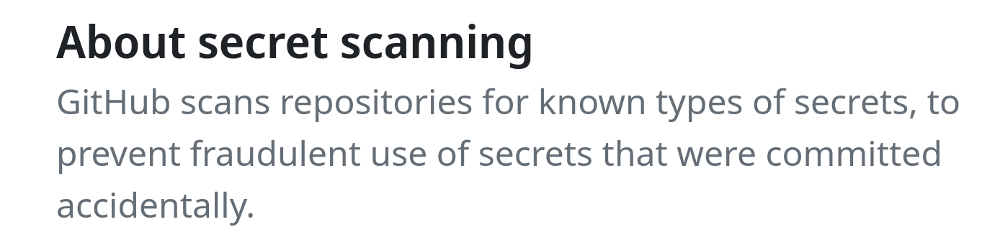

(secrets-in-code)=
# Secrets in the code
What are the secrets?
- API keys
- Login credentials for data ccess
- file paths (FSRDC!)
- Variable names (IRS!)

Store secrets in environment variables or files that are not published. Some services are serious about this, such as Github secret scanning:



## Where to store secrets
Store secrets in **environment variables** such as "[dot-env](https://pypi.org/project/python-dotenv/)" files in Python, "Renviron" files in R, or some other clearly identified file in the project or home directory. 

Example typed interactively (for Linux and Mac):

```plaintext
MYSECRET="dfad89ald"
CONFDATALOC="/path/to/irs/files"
```

The above is **not** recommended.

For storing secrets in files, use the same syntax as for contents of "dot-env" or "Renviron" files, and in fact `bash` or `zsh` files (`.bash_profile`, `.zshrc`).

:::::{tab-set}

::::{tab-item} R

Edit `.Renviron` (note the dot!) files:

```R
# Edit global (personal) Renviron
usethis::edit_r_environ()
# You can also consider creating project-specific settings:
usethis::edit_r_environ(scope = "project")
```

And use the variable defined in `.Renviron`:

```R
mysecret <- Sys.getenv('MYSECRET')
```

::::

::::{tab-item} Python

Loading regular environment variables:

```python
import os
mysecret = os.getenv("MYSECRET")  # will load environment variables
```

Loading with `dotenv`:
```python
from dotenv import load_dotenv
load_dotenv()  # take environment variables from project .env.
mysecret = os.getenv("MYSECRET")  # will load environment variables
```

::::

::::{tab-item} Stata
Yes, this also works in Stata

```stata
// load from environment
global mysecret : env MYSECRET
display "$mysecret"  // don't actually do this in code
```

and via (what else) a user-written package for loading from files:

```stata
net install doenv, from(https://github.com/vikjam/doenv/raw/master/) 
doenv using ".env"
global mysecret "`r(MYSECRET)'"
display "$mysecret"
```

Simplest solution:

```stata
//============ non-confidential parameters =========
include "config.do"

//============ confidential parameters =============
capture confirm file "$code/confidential/confparms.do"
if _rc == 0 {
    // file exists
    include "$code/confidential/confparms.do"
} else {
    di in red "No confidential parameters found"
}
//============ end confidential parameters =========
```
::::

:::::

