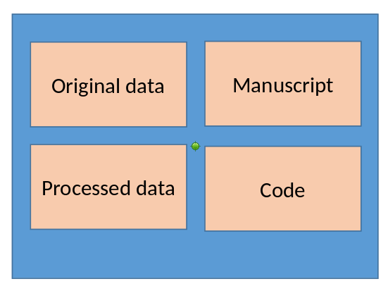

# Credits

Based on an earlier presentation and tutorial at the [Cornell Day of Data 2021](https://labordynamicsinstitute.github.io/day-of-data-2021/) with David Wasser and a presentation at [MONT^2](https://www.mont2-econlab.com/).

## Overview

| | | 
|----|-----|
| [Part 1:](#8)  |  When to start |
| [Part 2:](#15) | - Ideal directory and data structure <br/>- Adapting to confidential / big data |
| [Part 3:](#25) | - Ideal programming practices <br/> - Secure coding techniques|
| [Part 4:](#48) | - Documenting what you did <br/> - When to document |


# But first...

## Please Version your code and your results

- Even in restricted environment, use versioning
- If available, use `git`
  - If not available, request `git`
  - If not, use regular backups (scripted, automated)


# Computational Empathy

## Consider how the next person will (be able to) compute

- You don't know who that is
- You don’t know what they don’t know
- Will not have any of your add-on packages/ libraries/ etc. pre-installed
- Don’t force them (yourself!) to do tedious things

It might be "Future You!"


# Part 1 | When to start

## It is never too early

### Start thinking about the replication package when you start a project

- Setting up the structure at project setup
  - Directory structure
  - Constraints on processing and content (confidentiality)
- Starting a documentation shell, to fill in with details
- Capturing information as you progress through the project  
  - `git` branches!
  - Intermediate output

## It is never too late

### But it might be more work....

- Document as you progress
- Document when there are personnel changes
  - Debrief an RA who is leaving
  - Debrief a co-author who might be absent for a while

## Consider automation

### Repeatedly running through the entire sequence ensures later robustness

- Presumes a single control file (`main.do`, `run.sh`)
- Presumes ability to version results!
- Leverage (Census-specific) job queues
- Use free resources
  - Job queues with low priority
  - Human downtimes (leaving for a holiday, going to a conference)


## Consider automation

### Introduce break points

- Do not reprocess when no changes to data or code happen
- Always reprocess if data or code change 
- Decision might be 
  - Manual (flags)
  - Automated (`make`, checksums, etc.)
  
## Consider automation

### Introduce break points: manual

```{stata, eval=FALSE}
// Header  of main.do
global step1 0
global step2 1
global step3 1

if $step1 == 1  do "$code/01_dataclean.do"
if $step2 == 1  do "$code/02_merge_stuff.do"
if $step3 == 1  do "$code/03_figures.do"

```


## Consider automation

### Introduce break points: automated


```{stata, eval=FALSE}
// Header of main.do
global step1 1
global step2 1

// verify if file has changed
global checksum1 386698503
qui checksum "$resultfile1"
if `r(checksum)' == $checksum1 global step1 0 

if $step1 == 1  do "$code/01_dataclean.do"
if $step2 == 1  do "$code/02_merge_stuff.do"
if $step3 == 1  do "$code/03_figures.do"
```


# Part 2 | Ideal structure

## Generic project setup


[TIER Protocol](https://www.projecttier.org/tier-protocol/specifications-3-0/)

## Basic project setup


**Structure your project**

- Data inputs
- Data outputs
- Code
- Paper/text/etc.


## Project setup examples


<table width="100%">
<tr>
<td width="50%">
```
/inputs
/outputs
/code
/paper
```
</td><td>

```
/datos/
    /brutos
    /limpiados
    /finales
/codigo
/articulo
```
</td></tr></table>

It doesn't really matter, as long as it is logical. 


# Adapting to confidential / big data

## Back to the TIER protocol


## Back to the TIER protocol




## When data are confidential


## When data are confidential


## Project setup examples


<table width="100%">
<tr>
<td width="50%">

This may no longer work:

```
/datos/
    /brutos
    /limpiados
    /finales
/codigo
/articulo
```
</td>
<td>
This may be what it looks like:

```
/proyecto/
     /datos/
        /brutos
        /limpiados
        /finales
     /codigo
     /articulo
/secretos            (read-only)
     /impuestos      (read-only)
     /salarios       (read-only)
```

</td></tr></table>

How do we handle directories outside of the project space?


# Part 3: Programming practices

## Streamlining

- Controller  script (`main.do`, `run.sh`) preferred
  - Least amount of manual effort
- No manual copying of results 
  - dynamic documents!
  - Write out/save tables and figures using packages
- Clear instructions
- No manual install of packages
  - Use a script to create all directories, install all necessary packages/requirements/etc.

## Reproducibility

- No manual manipulation 
  - “Change the parameter to 0.2, then run the code again”
  - Use *functions*, ado files, programs, macros, subroutines
  - Use *loops*, parameters, *parameter files* to call those subroutines
  - Use *placeholders* (globals, macros, libnames, etc.) for common locations ($CONFDATA, $TABLES, $CODE)
- Compute all numbers in package
  - No manual calculation of numbers


## We already started a `main.do`

```{stata, eval=FALSE}
// Header of main.do
global step1 1
global step2 1

// verify if file has changed
global checksum1 386698503
qui checksum "$resultfile1"
if `r(checksum)' == $checksum1 global step1 0 

if $step1 == 1  do "$code/01_dataclean.do"
if $step2 == 1  do "$code/02_merge_stuff.do"
if $step3 == 1  do "$code/03_figures.do"
```

# Step further: Use configuration files 

## Stata configuration files {.smaller}

As file structure becomes more complex, configure short-cuts (globals, variables, etc.)

```{stata, eval=FALSE}
// config.do
global outputdata "/proyecto/datos/limpiados" // this is where you would write the data you create in this project
global results    "/proyecto/articulo"        // All tables for inclusion in your paper go here
global programs   "/proyecto/codigo"          // All programs (which you might "include") are to be found here
```

## Stata configuration files {.smaller}

Expanded to include non-project space directories: 

```{stata, eval=FALSE}
// config.do
global taxdata    "/secretos/impuestos"  
global salarydata "/secretos/salarios"  

global outputdata "/proyecto/datos/limpiados" // this is where you would write the data you create in this project
global results    "/proyecto/articulo"        // All tables for inclusion in your paper go here
global programs   "/proyecto/codigo"          // All programs (which you might "include") are to be found here
```

## Stata configuration files {.smaller}

Or something like this:

```{stata, eval=FALSE}
// config.do
global taxdata    "/data/irs1040"  
global salarydata "/data/lehd"  

global outputdata "/project/data/outputs"     // this is where you would write the data you create in this project
global results    "/project/article/tables"   // All tables for inclusion in your paper go here
global programs   "/project/code"             // All programs (which you might "include") are to be found here
```

## Stata configuration files {.smaller}

Let's expand it to contain another parameter:

```{stata, eval=FALSE}
// config.do
global taxdata    "/data/irs1040"  
global salarydata "/data/lehd"  

global outputdata "/project/data/outputs"     // this is where you would write the data you create in this project
global results    "/project/article/tables"   // All tables for inclusion in your paper go here
global programs   "/project/code"             // All programs (which you might "include") are to be found here

global checksum1 386698503
```

## Which is then included  {.smaller}

```{stata, eval=FALSE}
// Header of main.do

include "config.do"

global step1 1
global step2 1

// verify if file has changed
qui checksum "$resultfile1"
if `r(checksum)' == $checksum1 global step1 0 

if $step1 == 1  do "$code/01_dataclean.do"
if $step2 == 1  do "$code/02_merge_stuff.do"
if $step3 == 1  do "$code/03_figures.do"
```


# So far, nothing confidential

But let's extend it to confidential code.


# What is confidential code, you say? 

## What is confidential code, you say? 

- In the United States, some **variables on IRS databases** are considered super-top-secret. So you can't name that-variable-that-you-filled-out-on-your-Form-1040 in your analysis code of same data. (They are often referred to in jargon as "Title 26 variables"). 
- Your code contains the **random seed you used to anonymize** the sensitive identifiers. This might allow to reverse-engineer the anonymization, and is not a good idea to publish.
- You used a **look-up table hard-coded** in your Stata code to anonymize the sensitive identifiers (`replace anoncounty=1 if county="Tompkins, NY"`). A really bad idea, but yes, you probably want to hide that.
- Your IT specialist or  disclosure officer thinks publishing the **exact path** to your copy of the confidential 2010 Census data, e.g., "/data/census/2010", is a security risk and refuses to let that code through.
- You have adhered to disclosure rules, but for some reason, the precise minimum cell size is a confidential parameter.

So whether reasonable or not, this is an issue. How do you do that, without messing up the code, or spending hours redacting your code?

## Example 

- This will serve as an example. None of this is specific to Stata, and the solutions for R, Python, Julia, Matlab, etc. are all quite similar. 
- Assume that variables `q2f` and `q3e` are considered confidential by some rule, and that the minimum cell size `10` is also confidential.

```{stata, eval=FALSE}
set seed 12345
use q2f q3e county using "/data/economic/cmf2012/extract.dta", clear
gen logprofit = log(q2f)
by county: collapse (count)  n=q3e (mean) logprofit
drop if n<10
graph twoway n logprofit
```


## Do not do this

A bad example, because literally making more work for you and for future replicators, is to manually redact the confidential information with text that is not legitimate code:

```{stata, eval=FALSE}
set seed NNNNN
use <removed vars> county using "<removed path>", clear
gen logprofit = log(XXXX)
by county: collapse (count)  n=XXXX (mean) logprofit
drop if n<XXXX
graph twoway n logprofit
```

The redacted program above will no longer run, and will be very tedious to un-redact if a subsequent replicator obtains legitimate access to the confidential data.

## Better {.smaller}

Simply replacing the confidential data with replacement that are valid placeholders in the programming language of your choice is already better. Here's the confidential version of the file:

```{stata, eval=FALSE}
//============ confidential parameters =============
global confseed    12345
global confpath    "/data/economic/cmf2012"
global confprofit  q2f
global confemploy  q3e
global confmincell 10
//============ end confidential parameters =========
set seed $confseed
use $confprofit county using "${confpath}/extract.dta", clear
gen logprofit = log($confprofit)
by county: collapse (count)  n=$confemploy (mean) logprofit
drop if n<$confmincell
graph twoway n logprofit
```
## Better {.smaller}

and this would be the released file, part of the replication package:

```{stata, eval=FALSE}
//============ confidential parameters =============
global confseed    XXXX    // a number
global confpath    "XXXX"  // a path that will be communicated to you
global confprofit  XXX     // Variable name for profit T26
global confemploy  XXX     // Variable name for employment T26
global confmincell XXX     // a number
//============ end confidential parameters =========
set seed $confseed
use $confprofit county using "${confpath}/extract.dta", clear
gen logprofit = log($confprofit)
by county: collapse (count)  n=$confemploy (mean) logprofit
drop if n<$confmincell
graph twoway n logprofit
```

While the code won't run as-is, it is easy to un-redact, regardless of how many times you reference the confidential values, e.g., `q2f`, anywhere in the code.

## Best

Note that you have to re-run the entire code to obtain a modified graph, e.g., if you want to add some reference line, or change colors. But if the data presented in the graph is non-sensitive (i.e., disclosable), then the data underlying it is as well. Thus, and this is a more general approach, we can provide code that automatically detects if the confidential data is there, and only then will it run the data preparation part, but it will always run for the graphing ("analysis") part of the code. 

We also introduce the use of a separate file for all the confidential parameters, which may be more convenient, since now, no redaction is needed - the confidential file is simply dropped (but should be documented).

## Best {.smaller}

Main file `main.do`:

```{stata, eval=FALSE}
//============ confidential parameters =============
capture confirm file "include/confparms.do"
if _rc == 0 {
    // file exists
    include "include/confparms.do"
} else {
    di in red "No confidential parameters found"
}
//============ end confidential parameters =========

//============ non-confidential parameters =========
global safepath "releasable"
cap mkdir "$safepath"

//============ end parameters ======================
```

## Best {.smaller}

Main file `main.do` (continued)

```{stata, eval=FALSE}
// ::::  Process only if confidential data is present 

capture confirm  file "${confpath}/extract.dta"
if _rc == 0 {
   set seed $confseed
   use $confprofit county using "${confpath}/extract.dta", clear
   gen logprofit = log($confprofit)
   by county: collapse (count)  n=$confemploy (mean) logprofit
   drop if n<$confmincell
   save "${safepath}/figure1.dta", replace
} else { di in red "Skipping processing of confidential data" }

//============ at this point, the data is releasable ======
// ::::  Process always 

use "${safepath}/figure1.dta", clear
graph twoway n logprofit
graph export "${safepath}/figure1.pdf", replace
```

## Best {.smaller}

Auxiliary file `include/confparms.do` (not released)

```{stata, eval=FALSE}
//============ confidential parameters =============
global confseed    12345
global confpath    "/data/economic/cmf2012"
global confprofit  q2f
global confemploy  q3e
global confmincell 10
//============ end confidential parameters =========
```

## Best {.smaller}

Auxiliary file `include/confparms_template.do` (this is released)

```{stata, eval=FALSE}
//============ confidential parameters =============
global confseed    XXXX    // a number
global confpath    "XXXX"  // a path that will be communicated to you
global confprofit  XXX     // Variable name for profit T26
global confemploy  XXX     // Variable name for employment T26
global confmincell XXX     // a number
//============ end confidential parameters =========
```

## Best replication package

Thus, the replication package would have:

```
main.do
README.md
include/confparms_template.do
releasable/figure1.dta
releasable/figure1.pdf
```


# Part 4 | Wrapping up the replication package

## Wrapping up the replication package

- Using templates for reproducibility
- Documenting what you did
- When to document 

## Best replication package

We already had this:

```
main.do
README.md
include/confparms_template.do
releasable/figure1.dta
releasable/figure1.pdf
```

## What's in the README?


Start with our [fabulous template README](https://social-science-data-editors.github.io/template_README/). Really, it helps! Available at [https://social-science-data-editors.github.io/template_README/](https://social-science-data-editors.github.io/template_README/)


[](https://social-science-data-editors.github.io/template_README/)


## Three parts to README

- Data availability (and citations)
- Computer requirements
- Description of processing

## Start with the last part

That's easy: you've been keeping clean instructions since the start, right?

- Run "`main.do`"
- Describe what parts might be skipped
- Describe what the various parts do
- Describe which parts use confidential data

You've been doing that since day 1!

## Computer requirements

In most confidential environments, such as FSRDC/ IRE, this part is out of your control. But describe it anyway!

- Approximate description of computers/nodes used
  - memory size (but interested in actual usage, not max of what the system has!)
  - compute time! How long does a clean run, from top to bottom, take?
  - number of nodes: any parallel processing?
- Software
  - Version of software (Stata 17, update level)
  - All packages! Ideally, version of package (`which estout`)

Some of that is captured in your notes (updated, remember?), some of that may change over the life of the project, and may be captured in your logs, or your `qsub` files.

## Data availability

- This is easy: it's the data you requested to have included in your FSRDC project!
- So you had this info from Day -90 of the project!

## Data availability redux

In order to describe data availability, split into two: 

- how did YOU get access to the data (that's old) 
- how can OTHERS get access to the same data (that might be different!)
- The two are not always the same, but are both relevant. 

## Examples {.smaller}

Examples include 

- [this excellent description](https://social-science-data-editors.github.io/guidance/DCAS_Restricted_data.html#us-census-bureau-and-fsrdc) from a paper by [Teresa Fort](https://faculty.tuck.dartmouth.edu/teresa-fort/) ([ReStud](https://doi.org/10.1093/restud/rdw057)):


> 1. All the results in the paper use confidential microdata from the U.S. Census Bureau. To gain
access to the Census microdata, follow the directions here on how to write a proposal for access
to the data via a Federal Statistical Research Data Center:
https://www.census.gov/ces/rdcresearch/howtoapply.html.
> 2. You must request the following datasets in your proposal:
>   - Longitudinal Business Database (LBD), 2002 and 2007
>   - Foreign Trade Database – Import (IMP), 2002 and 2007
>   - Annual Survey of Manufactures (ASM), including the Computer Network Use      Supplement (CNUS), 1999
>   - [...]
>   - Annual Survey of Magical Inputs (ASMI), 2002 and 2007
> 3. Reference “Technology and Production Fragmentation: Domestic versus Foreign   Sourcing” by Teresa Fort, project number br1179 in the proposal. This will give you access to   the programs and input datasets required to reproduce the results. Requesting a search of archives   with the articles DOI ("10.1093/restud/rdw057") should yield the same results. 
>
>   NOTE: Project-related files are available for 10 years as of 2015. 


## Examples {.smaller}

Examples include 

- [this description](https://social-science-data-editors.github.io/guidance/Requested_information_dcas.html#example-for-confidential-data) by Fadlon and Nielsen about Danish data

> The information used in the analysis combines several Danish administrative registers (as described in the paper). The data use is subject to the European Union’s General Data Protection Regulation(GDPR) per new Danish regulations from May 2018. The data are physically stored on computers at Statistics Denmark and, due to security considerations, the data may not be transferred to computers outside Statistics Denmark. Researchers interested in obtaining access to the register data employed in this paper are required to submit a written application to gain approval from Statistics Denmark. The application must include a detailed description of the proposed project, its purpose, and its social contribution, as well as a description of the required datasets, variables, and analysis population. Applications can be submitted by researchers who are affiliated with Danish institutions accepted by Statistics Denmark, or by researchers outside of Denmark who collaborate with researchers affiliated with these institutions.

(Example taken from [Fadlon and Nielsen, AEJ:Applied 2021](https://doi.org/10.1257/app.20170604)).


## Three parts to README: timing

| | |
|---------|----------|
|- Data availability (and citations):|**Start of project, edit at the end**|
|- Computer requirements: | Middle of project|
|- Description of processing: | Middle of project|
| | |

with the end really just a last read/edit.

# Wrapping it all up

## Wrapping up

- Public replication package contains intelligible code, omits confidential details (but provides template code), has detailed data provenance statements
- Confidential replication package contains all the same, plus the confidential code, is archived in the FSRDC

Now you wait for the replicators to show up!

# Addenda

## Things to remember

- When doing a disclosure review request, remember to request the **code**
- When outputting statistics, *consider the disclosure rules* - the less changes, the faster the output (in theory), but in particular fewer surprises
- Do not think "*nobody will ever read this code*" - somebody is very likely to!

# Thanks

Find this presentation at [larsvilhuber.github.io/reproducibility-confidential-fsrdc](https://larsvilhuber.github.io/reproducibility-confidential-fsrdc)
