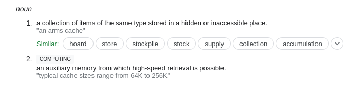

```{r setup, include=FALSE}
# At a minimum, this project environment should have rprojroot - the rest can later be dynamically added if necessary.
knitr::opts_chunk$set(echo = TRUE)
require("rprojroot")
basepath <- rprojroot::find_root(rprojroot::has_file("README.md"))
source(file.path(basepath,"libraries.R"))
```


## Intro

This document intends to demonstrate two methods of accessing big (or confidential) data. The first seems at first glance to be the most efficient way of doing it. But once you factor in time or cost constraints, there will be issues. 
The second method therefore breaks down the data and processing stream into separate components, and allows to separate the time consuming part from other reproducible parts.

## Context

We will use U.S. Census Bureau data (American Community Survey data) through an API. Downloading the entire corpus of ACS data would consume multiple 100 GB, but the API allows us to slice and dice the data. The example we will use will artificially reduce the amount of data for illustrative purposes, but we identify how this simple example becomes a "big data" example.

## Reproducibility setup

To make this whole setup reproducible, you can use several methods. For instance, you could use packages such as `checkpoint` to provide a reproducible environment. Please consult the [Checkpoint vignette](https://cran.r-project.org/web/packages/checkpoint/vignettes/checkpoint.html). 

Here, we have used a [**Docker image**](https://hub.docker.com/r/larsvilhuber/reproducibility-confidential) configured to use the [Rstudio Package Manager](https://packagemanager.rstudio.com/client/), fixed at **`r mran.date`**.


## Requirements {.smaller}

Other than a number of R requirements for general processing (`tidyverse`, citation), we will rely on the `tidycensus` package (citation here). 

```{r install-load-tidycensus}
pkgTest <- function(x)
{
	if (!require(x,character.only = TRUE))
	{
		install.packages(x,dep=TRUE)
		if(!require(x,character.only = TRUE)) stop("Package not found")
	}
	return("OK")
}
pkgTest("tidycensus")
pkgTest("tidyverse")
```

## Confidential parameters

Here, we use the `~/.Renviron` file (in my home directory, outside of the project directory), though I won't show you my actual file. Here's what the package documentation says

```{r, eval=FALSE}
census_api_key("111111abc", overwrite = TRUE, install = TRUE)
# First time, reload your environment so you can use the key without restarting R.
readRenviron("~/.Renviron")
# You can check it with:
Sys.getenv("CENSUS_API_KEY")

```

To reproduce this, [obtain a Census API key](http://api.census.gov/data/key_signup.html), and run the code above. We can then set the API key for the `tidycensus` package.

```{r loadkey}
if ( file.exists("~/.Renviron") ) { readRenviron("~/.Renviron") }
census_api_key(Sys.getenv("CENSUS_API_KEY"))
```

## Basic example

We're going to follow the "[Basic Usage tutorial](https://walker-data.com/tidycensus/articles/basic-usage.html) from the `tidycensus` website, and compute the median age by state for 2010:

```{r median_age_state}
time.age10 <- system.time(age10 <- get_decennial(geography = "state",
                       variables = "P013001",
                       year = 2010))
```

---


That was fast: 

```{r timing}
# time it took to run this
time.age10
```

it took **`r time.age10[3]` seconds**. But it only generated `r nrow(age10)` observations! 

```{r inspect}
# inspect the data
head(age10)
```

---

```{r stats}
# some stats
summary(age10)
```


## Bigger example

What if we used a bit more detail for this? Let's see this for Tompkins county (FIPS code "36109")

```{r median_age_block}
start.time <- Sys.time()
age10block <- get_decennial(geography = "block",state="NY", county="109", show_call=FALSE,
                       variables = "P013001",year = 2010)
time.block <- Sys.time() - start.time
```

---

That took 

```{r median_age_block_time}
# time it took to run this
time.block
```

**`r time.block` seconds**. It generated `r nrow(age10block)` observations. 

For ONE county.  

There are `r nrow(fips_codes)` counties in total. 


## Big data

In total, there are

```{r total_counties}
nrow(fips_codes)
```
counties.

But let's limit ourselves:

```{r set_up_big}
# prepare the next block
counties.to.query <- 30
# if we wanted all of this, we would replace the number with "nrow(fips_codes)"
# counties.to.query <- nrow(fips_codes)

```

Let's see how long this takes for the first `r counties.to.query` counties.

---

```{r loop_over_counties,cache=TRUE}
# tidycensus/Census API forces to loop over counties
start.time <- Sys.time()
blocks <- NA
for (row in 1:counties.to.query ) {
  county <- fips_codes[row,"county_code"]
  state  <- fips_codes[row,"state"]
  thisblock <- get_decennial(geography = "block",
                             state=state,
                             county=county,
                       variables = "P013001",
                       year = 2010)
  if ( row == 1 ) {
    blocks <- thisblock
    rm(thisblock)
  } else {
    blocks <- bind_rows(blocks,thisblock)
    rm(thisblock)
  }
}
end.time <- Sys.time()
elapsed.time <- end.time - start.time


```

---

That took **`r round(elapsed.time,2)` seconds** for `r counties.to.query` of `r nrow(fips_codes)` counties, yielding `r nrow(blocks)` records. 

You could estimate the total time as:

```{r estimate_time}
elapsed.scale <- elapsed.time / counties.to.query * nrow(fips_codes)
elapsed.scale
```

yielding

> **`r round(elapsed.scale/60,1)`** minutes

Would you want to incur that time every time you run the code for the entire country?

# Solution 1

## Solution 1: sampling

We already implemented the first solution, which is useful while you are developing this:

- we reduced the number down to a feasible number (**`r counties.to.query`** counties)
- estimated the total runtime (**`r round(elapsed.scale/60,1)`** minutes) 

Ideally, we would use two values for the parameter to control this: a really small number to test code for functionality, and a larger number to get some meaningful results. 


For the final run, we would set it to run on the full scope of the problem.

# Solution 2

## Solution 2: Intermediate files

The second solution is to break the problem apart. Let's see how long it takes to save and to read the resulting file. First, let's be clear about the directory structure here:

```{r setup_dirs}
basedata <- file.path(basepath,"data")
rawdata  <- file.path(basedata,"raw")
cache    <- file.path(basedata,"cache")
generated<- file.path(basedata,"generated")
```

---

We've defined three directories: 

- `basedata` to house all the data
- `rawdata` to house any data we may have (manually) downloaded from somewhere else
- `cache` to house intermediate data which can be programmatically downloaded, but maybe need a temporary home
- `generated` to house any data we generate by modifying either `rawdata` or `cache` data.


## Documentation!

Our README should describe this, and could also specify that all data in `cache` and `generated` can be recreated, given enough time.

We're going to use the cache to speed up processing for subsequent runs during testing and possibly for demonstration purposes.

## What is a cache?



## Reproducibility again {.smaller}

Let's make sure these directories exist:

```{r}
for ( dir in list(basedata,rawdata,cache,generated) ) {
  if (file.exists(dir)) {
    message(paste0("Directory ",dir," already present!"))
  } else {
    dir.create(file.path(dir),recursive=TRUE)
    message(paste0("Directory ",dir," created!"))
  }
}
```

Those steps would normally go into the header of our reproducible document!

## Timing

Let's move to the timing:

```{r saveread}
system.time(saveRDS(blocks,file = file.path(cache,"block_median.Rds")))
rm(blocks)
start.time <- Sys.time()
blocks <- readRDS(file=file.path(cache,"block_median.Rds"))
read.time <- Sys.time() - start.time
read.scaled <- read.time / counties.to.query * nrow(fips_codes)
```

Assuming that scaling up to the full filesize is linear, it would take **`r round(read.scaled,2)` seconds** to read back the entire universe of blocks from a cached file, compared to **`r round(elapsed.scale,2)` seconds** for using the API each time. 

## Refinements

How could this be even more refined? For one, we could test whether the cache file has already been generated in the download section:

```{r cache,eval=FALSE}
# not evaluated
cache.blocks <- file.path(cache,"block_median.Rds")

if ( file.exists(cache.blocks)) {
  blocks <- readRDS(cache.blocks)
} else {
  readin_from_api(outfile=cache.blocks)
}
```

---

Now we can routinely process this, without having to worry about that pesky download part.^[Note that Rmarkdown allows to define a section as cached as well. However, that cache is automatically invalidated when any code or text above it is modified, leading to potentially undesireable re-downloads. In this case, it may be better to work with a manually defined cache.]

## Generalizing

Note that the above works for any kind of programming language (Stata, SPSS, etc.). It also works and should be used for any large-ish files, and may percolate through an entire job stream.

## Robustness

So what happens when the API (inevitably) changes, breaks, is shut down, or otherwise stops working? 

> **Nothing.**

Because we have the cached file, we are safe from such breaks in the API. In fact, when providing our replication package, we should (if allowed by license) provide the cached file, yet not remove the part about downloading it. 

# Quick Summary

## Tips and Tricks

- Have the ability to test your code
  - Build tests into your code
- Use intermediate files / split your processing into pieces
- Check for intermediate files.

```{r,eval=FALSE}
# R:
if ( ! file.exists(file.path(intermediate,”step1.Rdata”)) {
    prepare_file(in=“step0”,out=“step1”,outpath=intermediate)
} else {
   message(“File exists, skipping processing”)
}
```
```{stata,eval=FALSE}
/* Stata */
capture confirm file “$intermediate/step1.dta"
  if _rc!=0 {
    process_file step0 step2 $intermediate
}  else {
    display " File exists, skipping processing "
  }
```

## Tips and Tricks 2

### Cleanly separate Confidential data and public use data

- You are going to have to provide copies of the public use data without compromising confidentiality

### Cleanly separate Confidential parameters and the rest of the code

- Reduces need to redact programs

## Tips and Tricks 3

**Cleanly separate and preserve**

- Data acquisition code
  - Or instructions, needs to be re-executable
- Confidential parameters and the rest of the code
  - Reduces need to redact programs
  - API keys and the like
- Intermediate data extracts
  - When its impossible to exactly re-extract data
  - When data extract takes a long time

# Exercise 3

## Exercise 3-1

```{r sysinfo,include=FALSE}
mysysinfo <- try(system("cat /proc/cpuinfo | grep 'model name' | tail -1 | awk -F: '{ print $2 } '",intern=TRUE))
```

<div class="blue3">

Run this whole document on your own computer or in the cloud!

- This was run on a `r mysysinfo`, and  took **`r round(elapsed.time,2)` seconds** for `r counties.to.query` counties. 
- How long does it take to run on yours?
- Clone this repository: [labordynamicsinstitute/reproducibility-confidential](https://github.com/labordynamicsinstitute/reproducibility-confidential)
- Open the `part3.Rmd` document, and `knit`.

Do you understand the various parts?

What is the connection with confidential data?

</div>


# Next [Part 4](part4.pdf)
