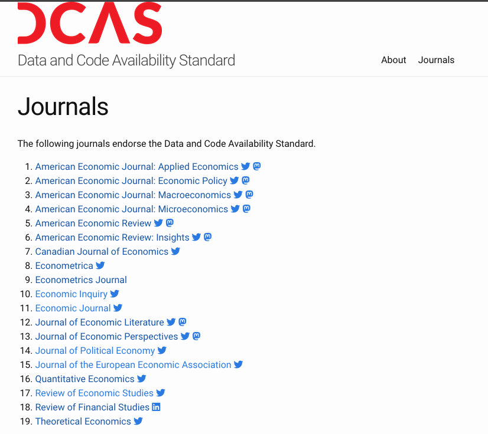

## Journals require replication packages

:::: {.columns}
:::{.column width="50%"}

:::
:::{.column width="50%"}

:::
::::

## What is a replication package?

- [AEA Data and Code Availability policy](https://www.aeaweb.org/journals/data/data-code-policy)
- [Data and Code Availability Standard](https://datacodestandard.org/)  
- [AEA Data and Code Repository](https://www.openicpsr.org/openicpsr/search/aea/studies)

## Example of deposit

